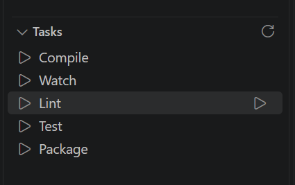

# Simple Task Tree

A lightweight tree view of the tasks defined in your `.vscode/tasks.json` - nothing else.

Most task explorer extensions try to detect every runnable thing in your workspace: npm scripts, shell files, Python scripts, build tools, and more. Simple Task Tree does none of that. It reads only the tasks you've explicitly declared in `tasks.json` and lists them, so the tree shows exactly what you put there.

## Features

- Tree view listing the tasks declared in `.vscode/tasks.json`
- Click a task to run it
- Multi-root workspaces are grouped by folder
- Refreshes automatically when `tasks.json` changes
- Move the view anywhere you like via drag and drop (native VS Code view behavior)

<!--  -->

## Usage

1. Open a workspace with a `.vscode/tasks.json` file.
2. Open the **Tasks** view (Explorer sidebar by default).
3. Click a task to run it, or use the refresh button in the view title bar.

## Settings

| Setting | Description | Default |
|---|---|---|
| `simpleTaskTree.sortOrder` | Order tasks are listed in: `tasksJson` (file order) or `alphabetical` | `tasksJson` |

## Contributing

See [CLAUDE.md](CLAUDE.md) for contribution guidelines.

## License

[MIT](LICENSE)
